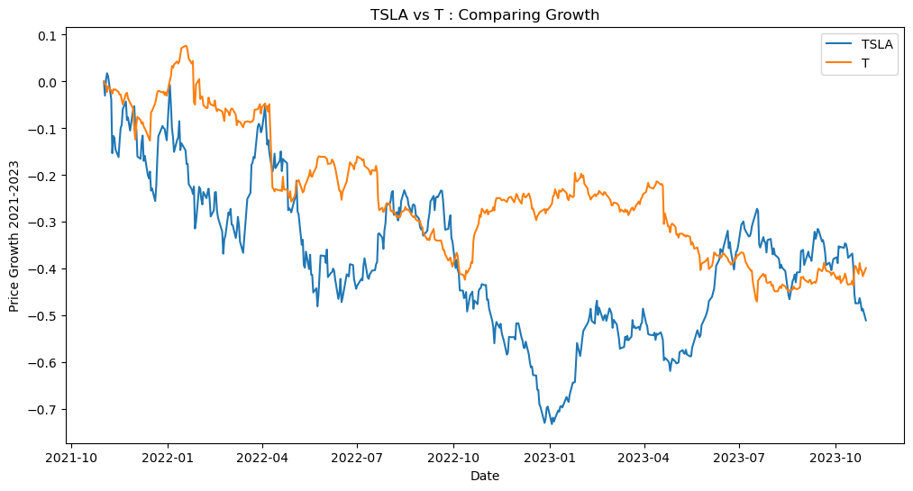
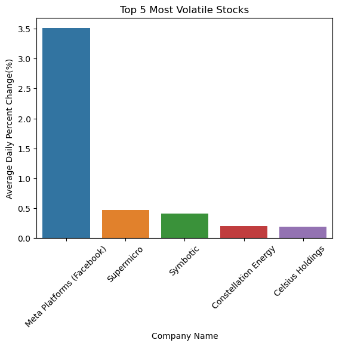
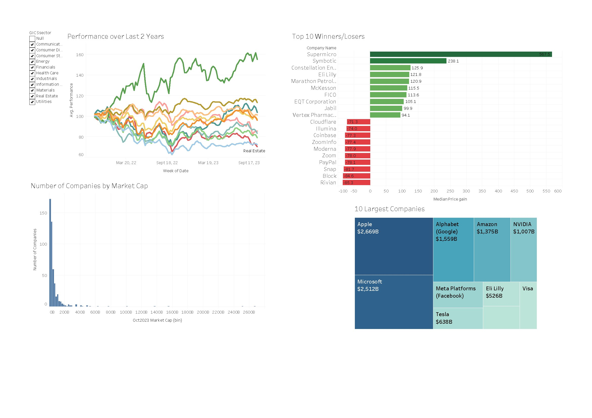

# LHL_DS-Midterm-Project
LHL Data Science Boot Camp Midterm Project. Contributors: Mario Guardado and Bilaal Khan

Project Title
Predictive Insight and Analysis From US Stock Market Data (2021-2023)

Introduction/Description
This project shows a indepth analysis of the US stock market data from November 2021 to Oct 2023. The aim of this project was to gain utilize the power of python libraries to access public data and ouput insights on stock market volatility, top winners and losers, and predictive modelling for the stocks based on the limited data and resources we had. The problem we aimed to solve is the ever lasting endeavor to maximize investment returns in the stock markets and to analyze stock behaviour for the retail investor to make an informed decision on their trades. 

Data Overview
The data we pulled was from Polygon.io which is a public reserve for Stock market data. The parameters of the data included US market data across all exchanges, from Nov 2021 to Oct 2023, and the relevant data pulled was Open price, Close Price, High Price and Low Price of each day for each stock over the last 2 year. 

Preprocessing and cleaning that was done was finding null values and inspecting the cause of the missing data, then removing duplicates and finally changing the data types to make EDA process easier. For example, changing the 'Date' column to datetime dtype so i could use pandas datetime functions to manipulate it later. Also changing the market cap column to float64 from object by removing special characters and just getting the final number to use for analysis later. 
 
Methods and Techniques Used
Brief overview of the analyses conducted, e.g., 
EDA - Included in the EDA process after cleaning was inspecting the data frame for its size and how much memory is required to run it. 

volatility analysis - I calculated the average daily percent change of each stock to measure volatility and then compared them agaist the top 5 most volatile.

growth calculation - I calculated growth for particular stocks by iterating through each day and getting the percentage value from the previous day close to the next day close. I did this for two stocks over the time frame that was set and compared them together. 
In addition, a logistic model was used to try and predict, based on all the column data we pulled from the API. The model worked by giving us a binary result on whether the price will go up the next day (1) or otherwise (0).

Results
From the logistic regression we quickly realized that we dont have remotely enough data or time to even remotely predict what a stock will do tomorrow. Our accuracy score for our model was just at 50% and was the same as flipping a coin. With more time, data and a more sophisticated statistic model, we may be able to increase that accuracy score a little past 50%. 

Visualizations
If you've included visualizations in the repo, mention them here, or you can embed some key plots directly in the README.

